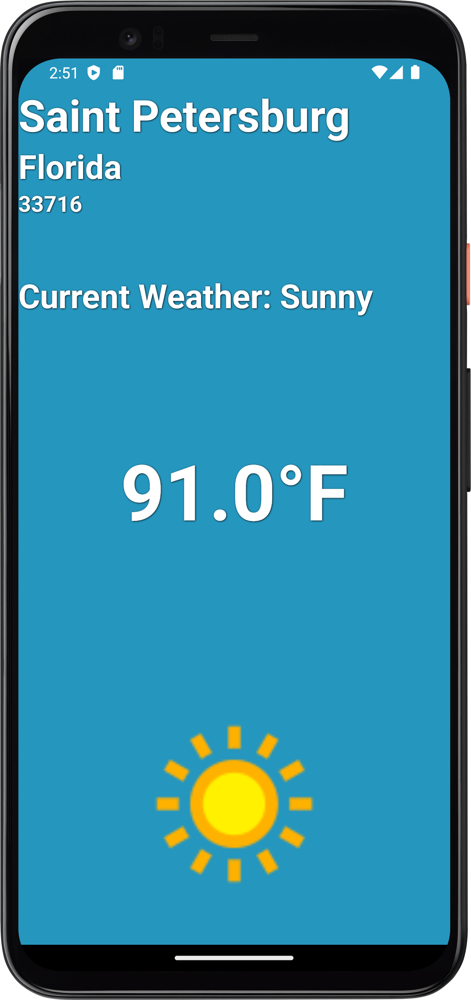
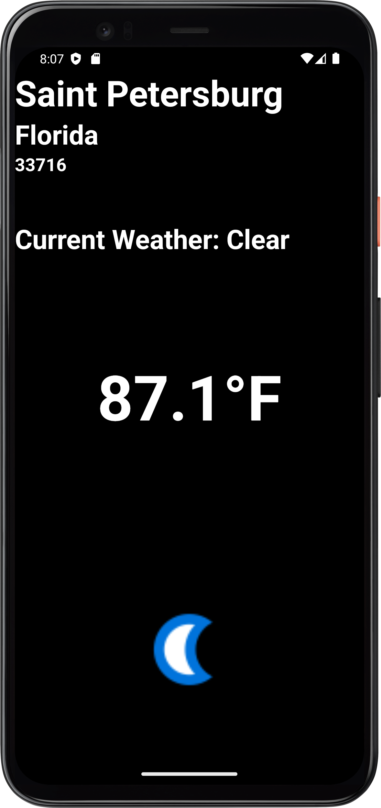

<h1 align="center">Dyaus</h1>
<h4 align="center"> Weather App </h4>

## Description
Built for a coding exercise, given by a potential client, this app uses RxJava2 and RxAndroid to ingest a WeatherAPI.com call and uses JSON response data in order to get the current weather for a dedicated zip code. The app digests the API call to display the City, State, zip code, a description of the current weather, the current temperature, a day or night status, and an icon to represent the current weather conditions.

Written in [Kotlin](https://kotlinlang.org/) using [MVVM](https://medium.com/swlh/understanding-mvvm-architecture-in-android-aa66f7e1a70b) architecture with a [ViewModel](https://developer.android.com/topic/libraries/architecture/viewmodel), [RxJava2](https://github.com/ReactiveX/RxJava), [RxAndroid](https://github.com/ReactiveX/RxAndroid), [Retrofit](https://square.github.io/retrofit/) consuming a [RESTful API](https://medium.com/android-news/consuming-rest-api-using-retrofit-library-in-android-ed47aef01ecb) and using [Picasso](https://square.github.io/picasso/) for handling icons. The App was written with best practices in mind.

## Client Requested Objectives

* Needed to be written in Kotlin
* Needed to target a minimum SDK of 21
* Needed to use RxJava2
* Needed to use RxAndroid
* Needed to use an API to import the required JSON data, could use an API of my choosing
* Needed to hard code a zip code of my choosing for the weather information
* Needed to get the City for the chosen zip code
* Needed to get the State for the chosen zip code
* Needed to get a description of the current weather for the chosen zip code
* Needed to get the current temperature for the chosen zip code
* Needed to get an icon matching the weather conditions for the current zip code
* Bonus points for MVVM architecture

## Improvements
* Implement caching of the weather data for chosen location (Possibly using [Room](https://developer.android.com/training/data-storage/room) or caching a .txt file locally for later reference)
* Write Unit tests
* Provide more data for the user (API provides more response data than is currently being shown)
* Update RxJava2/RxAndroid to [LiveData](https://developer.android.com/topic/libraries/architecture/livedata) (alternatively update RxJava2 to [RxJava3](https://github.com/ReactiveX/RxJava/wiki/What%27s-different-in-3.0))
* Implement a refresh button (include data point for `last_updated` timestamp that is provided by API)
* Add full screen background images displaying weather conditions
* Implement location services call instead of hard coding zip code (alternatively, make zip code a user entry field)
* Implement 5 day weather forecast API (separate API call)

## License
	Copyright 2023 Tyler OHearn
	
	Licensed under the Apache License, Version 2.0 (the "License");
	you may not use this file except in compliance with the License.
	You may obtain a copy of the License at
	
	   http://www.apache.org/licenses/LICENSE-2.0
	
	Unless required by applicable law or agreed to in writing, software
	distributed under the License is distributed on an "AS IS" BASIS,
	WITHOUT WARRANTIES OR CONDITIONS OF ANY KIND, either express or implied.
	See the License for the specific language governing permissions and
	limitations under the License.